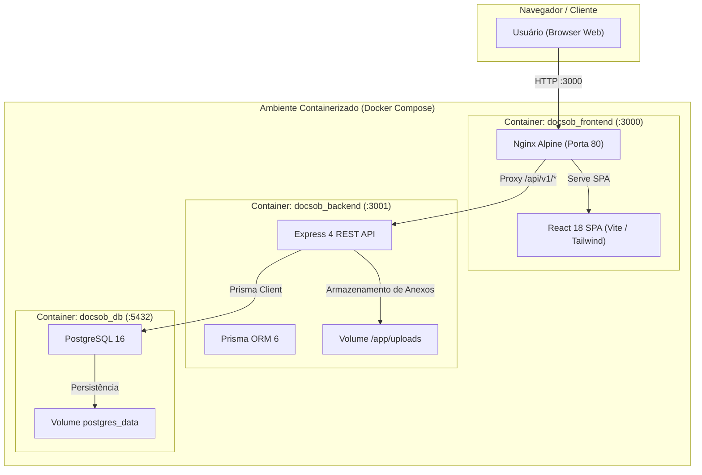

# DocsOb — Sistema de Gestão de Vencimento de Documentos

> Plataforma web para controle, acompanhamento e renovação de documentos corporativos com Matriz Visual de Cores, alertas de prazos críticos, sincronização com calendário e trilha de auditoria imutável (RN-008).

---

## 📑 Sumário

- [Arquitetura do Sistema](#-arquitetura-do-sistema)
- [Stack Tecnológica](#-stack-tecnológica)
- [Início Rápido com Docker (Recomendado)](#-início-rápido-com-docker-recomendado)
- [Início Rápido Local (Desenvolvimento)](#-início-rápido-local-desenvolvimento)
- [Credenciais de Demonstração (Seed Local)](#-credenciais-de-demonstração-seed-local)
- [Comandos e Scripts Disponíveis](#-comandos-e-scripts-disponíveis)
- [Matriz de Rotas e Endpoints da API](#-matriz-de-rotas-e-endpoints-da-api)
- [Testes Automatizados e E2E](#-testes-automatizados-e-e2e)
- [Troubleshooting & Dúvidas Frequentes](#-troubleshooting--dúvidas-frequentes)

---

## 🏛️ Arquitetura do Sistema

O DocsOb é estruturado como um monorepo modular composto por frontend SPA em React e backend API RESTful em Node.js com persistência no PostgreSQL:



---

## 🛠️ Stack Tecnológica

| Camada | Tecnologias Principais |
| :--- | :--- |
| **Frontend** | React 18, TypeScript (estrito), Vite, Tailwind CSS (Tema Midnight Navy), Recharts, Lucide Icons, React Hook Form + Zod, Axios |
| **Backend** | Node.js 20, Express 4, TypeScript 5, Prisma ORM 6, Zod, JWT, BCrypt, Multer |
| **Banco de Dados** | PostgreSQL 16 Alpine |
| **Infraestrutura** | Docker, Docker Compose, Nginx Alpine (Reverse Proxy + SPA Fallback) |
| **Testes** | Vitest, Supertest (Testes unitários, integração e E2E) |

---

## 🐳 Início Rápido com Docker (Recomendado)

O provisionamento completo com banco de dados PostgreSQL, backend com migrações automáticas e seed, e frontend servido por Nginx pode ser realizado em um único comando:

### 1. Clonar o repositório e subir os serviços:

```bash
git clone <url-do-repositorio>
cd implementer-antigravity

# Constrói as imagens e inicia os containers em segundo plano
docker compose up -d --build
```

### 2. Acessar a aplicação:

- 🌐 **Frontend (Aplicação Web):** [http://localhost:3000](http://localhost:3000)
- 🔌 **Backend API:** [http://localhost:3001/api/v1/health](http://localhost:3001/api/v1/health)
- 🗄️ **PostgreSQL:** `localhost:5432` (Usuário: `postgres`, Senha: `postgres`, Banco: `docsob`)

---

## 💻 Início Rápido Local (Desenvolvimento)

Para desenvolver localmente com hot-reload no backend e frontend:

### 1. Instalar dependências da raiz e dos módulos:

```bash
npm install
```

### 2. Configurar variáveis de ambiente:

- **Linux / macOS (Bash):**
  ```bash
  cp .env.example backend/.env
  ```
- **Windows (PowerShell):**
  ```powershell
  Copy-Item .env.example backend/.env
  ```
- **Windows (CMD):**
  ```cmd
  copy .env.example backend\.env
  ```

### 3. Iniciar o PostgreSQL via Docker:

```bash
docker compose up -d postgres
```

### 4. Executar migrações e seed do banco de dados:

```bash
npm run db:migrate
npm run db:seed
```

### 5. Iniciar Backend e Frontend concorrentemente:

```bash
npm run dev:all
```
- Backend disponível em: `http://localhost:3001`
- Frontend disponível em: `http://localhost:5173`

---

## 🔑 Credenciais de Demonstração (Seed Local)

O seed inicial cria automaticamente dois perfis de usuário para testes:

| Perfil | E-mail de Acesso | Senha Padrão | Permissões (RBAC) |
| :--- | :--- | :--- | :--- |
| **Administrador** | `admin@docsob.com.br` | `Admin123!@#` | Acesso total: Painel, Documentos, Calendário, Auditoria, Gestão de Usuários e Configurações |
| **Operacional** | `operacional@docsob.com.br` | `Operacional123!@#` | Operações diárias: Painel, Cadastro de Documentos, Renovação e Calendário |

> ⚠️ **Aviso de Segurança:** As senhas acima destinam-se exclusivamente ao ambiente local e de demonstração. Em ambientes de produção, defina senhas fortes e altere a chave `JWT_SECRET`.

---

## 📋 Comandos e Scripts Disponíveis

Todos os comandos podem ser executados a partir da raiz do repositório:

| Comando | Descrição |
| :--- | :--- |
| `npm run dev:all` | Inicia backend (3001) e frontend (5173) concorrentemente com hot-reload |
| `npm run build:all` | Compila o backend (TypeScript) e o frontend (Vite) para produção |
| `npm run test:unit` | Executa a suíte de testes unitários do backend e validação de tipos do frontend |
| `npm run test:e2e` | Executa a suíte de testes E2E / integração HTTP contra os endpoints reais |
| `npm run test:all` | Executa todos os testes da aplicação |
| `npm run db:migrate` | Aplica migrações Prisma pendentes no banco |
| `npm run db:deploy` | Aplica migrações em produção sem criar novos arquivos |
| `npm run db:seed` | Executa o seed de dados iniciais (usuários e categorias) |
| `npm run db:reset` | **Destrutivo:** Reseta o banco de dados e reaplica migrações |
| `npm run docker:up` | Constrói imagens e inicia todos os containers do Docker Compose |
| `npm run docker:down` | Para e remove os containers (mantém volumes de dados) |
| `npm run docker:reset` | **Destrutivo:** Destrói volumes (`-v`), reconstrói imagens e reinicia |
| `npm run docker:logs` | Visualiza logs consolidados de todos os serviços Docker em tempo real |
| `npm run clean` | Limpa pastas `dist/` e arquivos temporários |

---

## 🌐 Matriz de Rotas e Endpoints da API

Todas as rotas da API são prefixadas com `/api/v1`:

### Autenticação & Perfil
- `POST /api/v1/auth/login` — Autenticação de usuário e emissão de token JWT
- `GET /api/v1/auth/me` — Consulta dados do usuário autenticado

### Documentos & Renovação
- `GET /api/v1/documents` — Listagem paginada com filtros (status, categoria, busca, arquivados)
- `POST /api/v1/documents` — Cadastro de documento com upload de anexo multipart
- `GET /api/v1/documents/:id` — Detalhes do documento com histórico de versões e auditoria
- `PUT /api/v1/documents/:id` — Edição de dados do documento
- `POST /api/v1/documents/:id/renew` — Renovação com arquivamento da versão anterior (RN-002)
- `PATCH /api/v1/documents/:id/archive` — Alternar arquivamento manual (Admin only)
- `DELETE /api/v1/documents/:id` — Exclusão permanente de documento (Admin only)
- `GET /api/v1/documents/:id/attachment` — Download do arquivo anexo autenticado

### Categorias de Documentos
- `GET /api/v1/categories` — Listagem de categorias
- `POST /api/v1/categories` — Criação de nova categoria (Admin only)
- `DELETE /api/v1/categories/:id` — Exclusão de categoria sem vínculos (Admin only)

### Painel & Relatórios
- `GET /api/v1/dashboard/metrics` — Métricas consolidadas de status, conformidade e vencimentos
- `GET /api/v1/reports/summary` — Resumo executivo com filtros de período e status
- `GET /api/v1/reports/export` — Exportação de relatórios em formato CSV (com UTF-8 BOM) ou JSON

### Calendário & Sincronização
- `GET /api/v1/calendar/events` — Prazos e eventos filtrados por mês e ano
- `POST /api/v1/calendar/sync` — Sincronização manual com Google Agenda (OAuth por usuário)
- `GET /api/v1/calendar/sync-logs` — Logs de sincronização da agenda (Admin only)

### Trilha de Auditoria & Administração (Admin Exclusivo)
- `GET /api/v1/audit-logs` — Listagem paginada de logs de auditoria com diffs
- `GET /api/v1/audit-logs/:id` — Detalhe individual de um registro de auditoria
- `GET /api/v1/users` — Listagem de usuários
- `POST /api/v1/users` — Cadastro de novo usuário
- `PUT /api/v1/users/:id` — Atualização de cadastro de usuário
- `PATCH /api/v1/users/:id/status` — Ativação/inativação de usuário (protege contra auto-inativação)
- `PATCH /api/v1/users/:id/password` — Redefinição de senha de usuário
- `GET /api/v1/company/config` — Consulta política de notificação (RN-004)
- `PUT /api/v1/company/config` — Alteração do modo de notificação da empresa
- `POST /api/v1/notifications/recalculate` — Recálculo manual de status e envio de alertas
- `POST /api/v1/notifications/digest` — Disparo manual do Daily Digest consolidado

---

## 🧪 Testes Automatizados e E2E

O projeto possui cobertura de testes automatizados com Vitest:

```bash
# Executar todos os testes unitários do backend e checagem de tipos do frontend:
npm run test:unit

# Executar a suíte de testes de integração E2E:
npm run test:e2e
```

---

## 🔧 Troubleshooting & Dúvidas Frequentes

### 1. Conflito de portas no host (`3000`, `3001` ou `5432`)
Se alguma porta já estiver em uso por outro serviço, você pode alterar as portas no arquivo `.env` ou passar variáveis na chamada do Docker Compose:
```bash
FRONTEND_PORT=3100 BACKEND_PORT=3101 POSTGRES_PORT=5433 docker compose up -d --build
```

### 2. Quebras de linha CRLF no Windows
Todos os scripts shell possuem normalização automática no Dockerfile e estão configurados com LF no arquivo `.gitattributes`. Caso edite scripts shell localmente no Windows, certifique-se de salvar em formato LF.

### 3. Limpeza total de containers e volumes
Para recriar todo o ambiente do zero (apagando dados do banco e uploads):
```bash
npm run docker:reset
```
