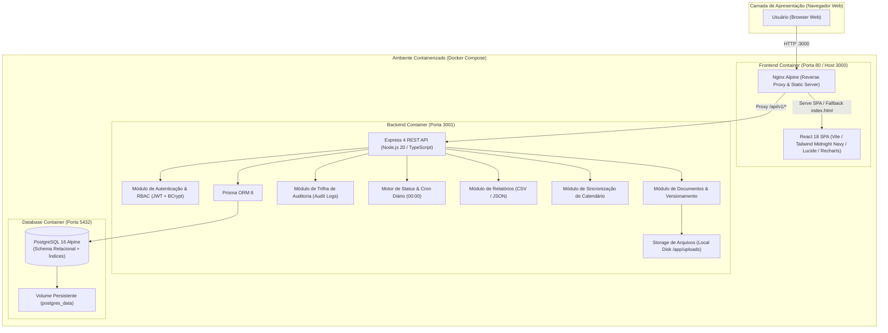
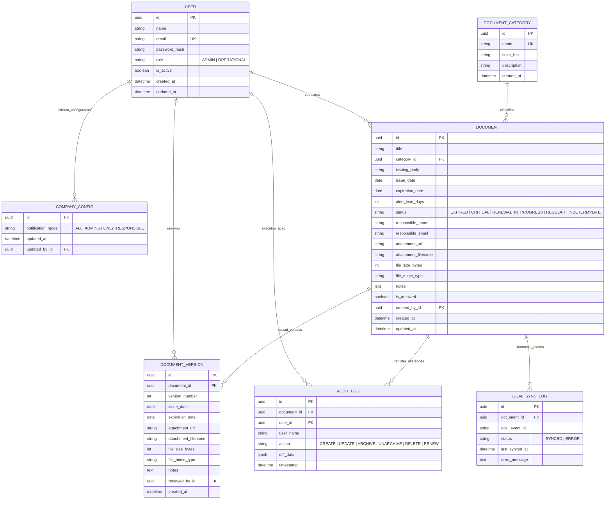
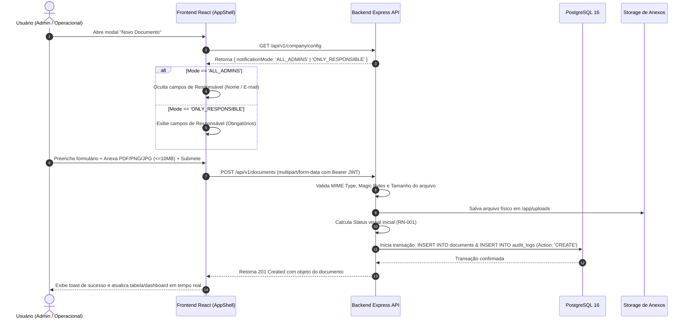
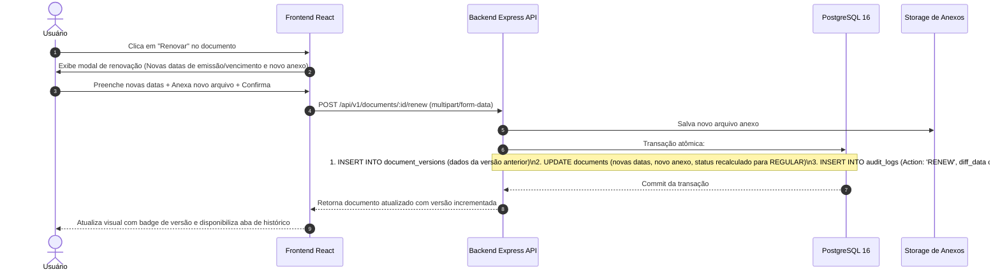

# Especificação de Arquitetura do Sistema — DocsOb

| Informação | Detalhe |
| :--- | :--- |
| **Projeto** | DocsOb — Gestão de Vencimento de Documentos |
| **Fase Atual** | Concluído e Validado (Fases 1 a 4 Concluídas) |
| **Status** | Implementado, Validado e Operacional |
| **Versão** | 1.1.0 |
| **Última Atualização** | 2026-08-27 |
| **Documento Relacionado** | [PRD.md](./PRD.md) |

---

## 1. Visão Geral da Arquitetura

O sistema **DocsOb** é construído sob uma arquitetura desacoplada e conteinerizada (Client-Server / RESTful API / Local-First), projetada para responder com alta performance (tempo de resposta < 200ms), garantindo auditoria imutável, sincronização de prazos e controle estrito de acessos baseado em perfis (RBAC).



---

## 2. Modelo de Dados (ERD — Entidade e Relacionamento)



---

## 3. Dicionário de Dados e Estrutura de Tabelas

### 3.1 Tabela: `company_configs` (Configuração Global da Empresa)
- `id` (UUID, PK): Identificador único da configuração.
- `notification_mode` (VARCHAR(30), NOT NULL):
  - `'ALL_ADMINS'`: Todos os Administradores recebem alertas. O campo "Responsável" é **oculto** na UI e nulo no banco.
  - `'ONLY_RESPONSIBLE'`: Apenas o e-mail do Responsável cadastrado no documento recebe alertas. O campo "Responsável" é **obrigatório**.
- `updated_at` (TIMESTAMP, NOT NULL): Data e hora da última alteração.
- `updated_by_id` (UUID, FK -> `users.id`): ID do Administrador que atualizou.

### 3.2 Tabela: `users` (Usuários e Controle de Acesso)
- `id` (UUID, PK): Identificador único do usuário.
- `name` (VARCHAR(150), NOT NULL): Nome completo.
- `email` (VARCHAR(150), UNIQUE, NOT NULL): E-mail institucional normalizado em minúsculas.
- `password_hash` (VARCHAR(255), NOT NULL): Hash seguro gerado via BCrypt (salt rounds 10).
- `role` (VARCHAR(20), NOT NULL): Papel de acesso:
  - `'ADMIN'`: Acesso irrestrito (Auditoria, Gestão de Usuários, Configurações, Documentos Arquivados, Hard Delete).
  - `'OPERATIONAL'`: Acesso a cadastro, edição, renovação, upload e consulta de calendário.
- `is_active` (BOOLEAN, DEFAULT TRUE): Status da conta (bloqueia login quando `false`).
- `created_at` (TIMESTAMP, DEFAULT NOW()): Data de cadastro.
- `updated_at` (TIMESTAMP, DEFAULT NOW()): Data da última alteração.

### 3.3 Tabela: `document_categories` (Categorias de Documentos)
- `id` (UUID, PK): Identificador único da categoria.
- `name` (VARCHAR(100), UNIQUE, NOT NULL): Nome da categoria (ex: Fiscal, Trabalhista, Licenças, Contratos).
- `color_hex` (VARCHAR(7), NOT NULL): Cor hexadecimal para identificação visual em badges.
- `description` (VARCHAR(255), NULLABLE): Descrição detalhada da categoria.
- `created_at` (TIMESTAMP, DEFAULT NOW()): Data de cadastro.

### 3.4 Tabela: `documents` (Cadastro Principal de Documentos)
- `id` (UUID, PK): Identificador do documento.
- `title` (VARCHAR(200), NOT NULL): Nome/título do documento.
- `category_id` (UUID, FK -> `document_categories.id`, NOT NULL): Categoria associada.
- `issuing_body` (VARCHAR(150), NULLABLE): Entidade ou órgão emissor.
- `issue_date` (DATE, NOT NULL): Data de emissão.
- `expiration_date` (DATE, NULLABLE): Data de vencimento (NULL = Validade Indeterminada / Permanente).
- `alert_lead_days` (INT, DEFAULT 30): Antecedência em dias para disparar alertas críticos.
- `status` (VARCHAR(30), NOT NULL): Status visual calculado:
  - `'EXPIRED'` (🔴 Vencido)
  - `'CRITICAL'` (🟡 Alerta Crítico)
  - `'RENEWAL_IN_PROGRESS'` (🔵 Em Renovação)
  - `'REGULAR'` (🟢 Regular / Em Dia)
  - `'INDETERMINATE'` (⚪ Validade Permanente)
- `responsible_name` (VARCHAR(150), NULLABLE): Nome do responsável (condicional).
- `responsible_email` (VARCHAR(150), NULLABLE): E-mail do responsável (condicional).
- `attachment_url` (VARCHAR(500), NULLABLE): Caminho relativo do arquivo no storage.
- `attachment_filename` (VARCHAR(255), NULLABLE): Nome original do arquivo anexado.
- `file_size_bytes` (INT, NULLABLE): Tamanho em bytes (limite de 10 MB = 10.485.760 bytes).
- `file_mime_type` (VARCHAR(100), NULLABLE): MIME type (`application/pdf`, `image/png`, `image/jpeg`).
- `notes` (TEXT, NULLABLE): Instruções e observações de renovação.
- `is_archived` (BOOLEAN, DEFAULT FALSE): Soft delete (documento arquivado).
- `created_by_id` (UUID, FK -> `users.id`): Usuário criador do registro.
- `created_at` (TIMESTAMP, DEFAULT NOW()): Data de criação.
- `updated_at` (TIMESTAMP, DEFAULT NOW()): Data da última atualização.

### 3.5 Tabela: `document_versions` (Histórico de Renovações)
- `id` (UUID, PK): Identificador da versão histórica.
- `document_id` (UUID, FK -> `documents.id`, NOT NULL): Documento de referência.
- `version_number` (INT, NOT NULL): Número sequencial da versão arquivada (1, 2, 3...).
- `issue_date` (DATE, NOT NULL): Data de emissão da versão antiga.
- `expiration_date` (DATE, NOT NULL): Data de vencimento da versão antiga.
- `attachment_url` (VARCHAR(500), NULLABLE): Link do anexo histórico.
- `attachment_filename` (VARCHAR(255), NULLABLE): Nome do anexo histórico.
- `file_size_bytes` (INT, NULLABLE): Tamanho do arquivo histórico.
- `file_mime_type` (VARCHAR(100), NULLABLE): MIME type do arquivo histórico.
- `notes` (TEXT, NULLABLE): Observações registradas na renovação.
- `renewed_by_id` (UUID, FK -> `users.id`): Usuário que efetuou a renovação.
- `created_at` (TIMESTAMP, DEFAULT NOW()): Data do registro da versão.

### 3.6 Tabela: `audit_logs` (Trilha de Auditoria Imutável — RN-008)
- `id` (UUID, PK): Identificador do log.
- `document_id` (UUID, FK -> `documents.id`, NULLABLE): Documento auditado (NULL se exclusão definitiva).
- `user_id` (UUID, FK -> `users.id`, NOT NULL): Autor da ação.
- `user_name` (VARCHAR(150), NOT NULL): Nome do usuário no momento da ação.
- `action` (VARCHAR(30), NOT NULL): `'CREATE'`, `'UPDATE'`, `'ARCHIVE'`, `'UNARCHIVE'`, `'DELETE'`, `'RENEW'`.
- `diff_data` (JSONB, NOT NULL): Objeto JSON detalhado com valores anteriores (`old`) e novos (`new`).
- `timestamp` (TIMESTAMP, DEFAULT NOW()): Timestamp exato da operação.

### 3.7 Tabela: `gcal_sync_logs` (Logs de Sincronização de Calendário)
- `id` (UUID, PK): Identificador do log de sincronização.
- `document_id` (UUID, FK -> `documents.id`, NULLABLE): Documento associado ao evento.
- `gcal_event_id` (VARCHAR(255), NULLABLE): Identificador do evento gerado.
- `status` (VARCHAR(30), NOT NULL): `'SYNCED'` ou `'ERROR'`.
- `last_synced_at` (TIMESTAMP, DEFAULT NOW()): Data e hora da sincronização.
- `error_message` (TEXT, NULLABLE): Detalhes de eventuais falhas.

---

## 4. Matriz de Cores e Lógica de Cálculo de Status (RN-001)

A lógica de cálculo do status visual é unificada no serviço `statusService.ts` e executada de forma atômica:

```
SE expiration_date É NULL OU tipo É "Sem Vencimento":
    Status = ⚪ INDETERMINATE (Validade Permanente)
SENÃO SE status_manual É "RENEWAL_IN_PROGRESS" (Em Renovação):
    Status = 🔵 RENEWAL_IN_PROGRESS (Em Renovação)
SENÃO SE DataAtual > expiration_date:
    Status = 🔴 EXPIRED (Vencido)
SENÃO SE (expiration_date - DataAtual em dias) <= alert_lead_days:
    Status = 🟡 CRITICAL (Alerta Crítico)
SENÃO:
    Status = 🟢 REGULAR (Em Dia)
```

- **Recálculo em Tempo Real**: Executado a cada mutação (criação, edição, renovação).
- **Recálculo Batch Agendado**: Executado automaticamente diariamente à meia-noite (`00:00:00`) via `cronService.ts`, atualizando todos os registros e disparando os alertas de e-mail pertinentes.

---

## 5. Matriz de Controle de Acesso Baseado em Papéis (RBAC — RF-014)

| Funcionalidade / Recurso | Rota de API | Administrador (`ADMIN`) | Operacional (`OPERATIONAL`) |
| :--- | :--- | :---: | :---: |
| Autenticação e Consulta de Perfil | `POST /auth/login`, `GET /auth/me` | ✅ Permitido | ✅ Permitido |
| Listar e Filtrar Documentos | `GET /documents` | ✅ Permitido (com arquivados) | ✅ Permitido (sem arquivados) |
| Criar e Editar Documentos | `POST /documents`, `PUT /documents/:id` | ✅ Permitido | ✅ Permitido |
| Download de Anexos | `GET /documents/:id/attachment` | ✅ Permitido | ✅ Permitido |
| Renovar Documento | `POST /documents/:id/renew` | ✅ Permitido | ✅ Permitido |
| Arquivar Documento (Soft Delete) | `PATCH /documents/:id/archive` | ✅ Permitido | ✅ Permitido |
| Excluir Permanentemente (Hard Delete) | `DELETE /documents/:id` | ✅ Permitido | ❌ 403 Forbidden |
| Gestão de Categorias | `POST /categories`, `DELETE /categories/:id` | ✅ Permitido | ❌ 403 Forbidden |
| Visualizar Trilha de Auditoria | `GET /audit-logs`, `GET /audit-logs/:id` | ✅ Permitido | ❌ 403 Forbidden |
| Exportar Relatórios (CSV/JSON) | `GET /reports/export`, `GET /reports/summary` | ✅ Permitido | ✅ Permitido |
| Visualizar Calendário | `GET /calendar/events` | ✅ Permitido | ✅ Permitido |
| Sincronizar Agenda & Logs | `POST /calendar/sync`, `GET /calendar/sync-logs` | ✅ Permitido | ❌ 403 Forbidden (Logs) |
| Gestão de Usuários (CRUD/Status/Senha) | `/users/*` | ✅ Permitido | ❌ 403 Forbidden |
| Configurações da Empresa | `GET /company/config`, `PUT /company/config` | ✅ Permitido | ❌ 403 Forbidden |
| Recálculo / Digest Manual | `/notifications/*` | ✅ Permitido | ❌ 403 Forbidden |

---

## 6. Fluxos de Trabalho Principais

### 6.1 Cadastro com Validação Condicional de Responsável (RN-004)



### 6.2 Renovação de Documento com Histórico de Versão (RN-002 & RN-008)



---

## 7. Decisões de Arquitetura Tecnológica (ADRs)

### ADR-001: Arquitetura Monorepo Modular Local-First
- **Decisão**: Adotar estrutura monorepo com pastas independentes `backend/` e `frontend/`, scripts cross-platform no `package.json` raiz e orquestração Docker Compose unificada.
- **Racional**: Permite que desenvolvedores e operadores executem o sistema completo com 1 único comando (`docker compose up --build`), garantindo ambiente isolado, paridade de desenvolvimento/produção e facilidade de testes E2E.

### ADR-002: Containerização Multi-Stage e Nginx SPA Proxy
- **Decisão**: O frontend é compilado via multi-stage build no Dockerfile e servido por container Nginx Alpine ultra-leve, que atua simultaneamente como servidor de estáticos (com SPA Fallback para `index.html`) e Reverse Proxy redirecionando chamadas `/api/v1/*` para o container do backend.
- **Racional**: Elimina problemas de CORS, unifica a porta de entrada da aplicação (`http://localhost:80` ou `3000`), reduz o tamanho final da imagem e protege os headers HTTP com gzip e security policies.

### ADR-003: Abstração de Armazenamento de Arquivos (`IStorageService`)
- **Decisão**: Implementar o armazenamento de arquivos anexos desacoplado através de uma interface de serviço (`IStorageService` e `LocalStorageService`).
- **Racional**: Garante custo zero no MVP armazenando arquivos no disco local montado em volume `/app/uploads`, permitindo migração futura imediata para Amazon S3 ou Supabase Storage apenas criando uma nova implementação da interface.

### ADR-004: Trilha de Auditoria com Diff Estruturado em JSON
- **Decisão**: Registrar todas as mutações na tabela `audit_logs` contendo autor, ação e um payload JSONB com o diff explícito (`old` vs `new`).
- **Racional**: Atende integralmente a regra RN-008 e viabiliza a renderização de componentes de comparação visual no frontend sem necessidade de recálculos complexos.

### ADR-005: Suíte de Testes Automatizados em Três Camadas
- **Decisão**: Estruturar a garantia de qualidade em 3 esteiras:
  1. **Testes Unitários / Integração Backend (Vitest)**: 140 casos cobrindo controllers, services, middlewares e regras de negócio.
  2. **Testes Unitários Frontend (Vitest + React Testing Library)**: 28 casos cobrindo autenticação, formulários, RBAC e modais.
  3. **Testes E2E HTTP Integrados (Vitest + Docker Runner)**: 19 casos cobrindo os cenários TC-01 a TC-08 contra containers reais em portas dinâmicas com teardown garantido.
- **Racional**: 100% de confiabilidade nas entregas, prevenindo regressões em upgrades e refatorações.

---

## 8. Status de Implementação e Verificação das Fases

Todas as 4 fases do projeto foram concluídas com sucesso:

| Fase | Descrição | Status | Evidência de Conclusão |
| :--- | :--- | :---: | :--- |
| **Fase 1** | Levantamento de Requisitos e PRD | ✅ Concluído | [PRD.md](./PRD.md) aprovado com matriz de regras de negócio. |
| **Fase 2** | Arquitetura e Modelagem de Dados | ✅ Concluído | [ARCHITECTURE.md](./ARCHITECTURE.md), Schema Prisma e ERD. |
| **Fase 3** | Implementação Full-Stack | ✅ Concluído | Backend REST API, Frontend SPA React, Design System Midnight Navy. |
| **Fase 4** | Dockerização, Scripts e Testes E2E | ✅ Concluído | Docker Compose unificado, scripts `run-e2e.mjs`, **187/187 testes passando**. |
