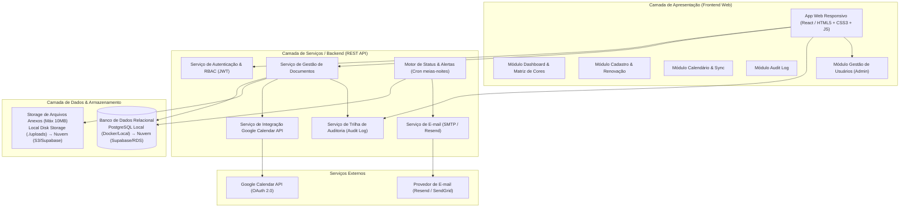
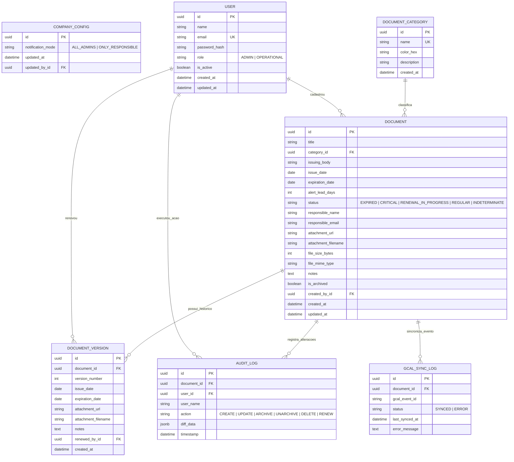
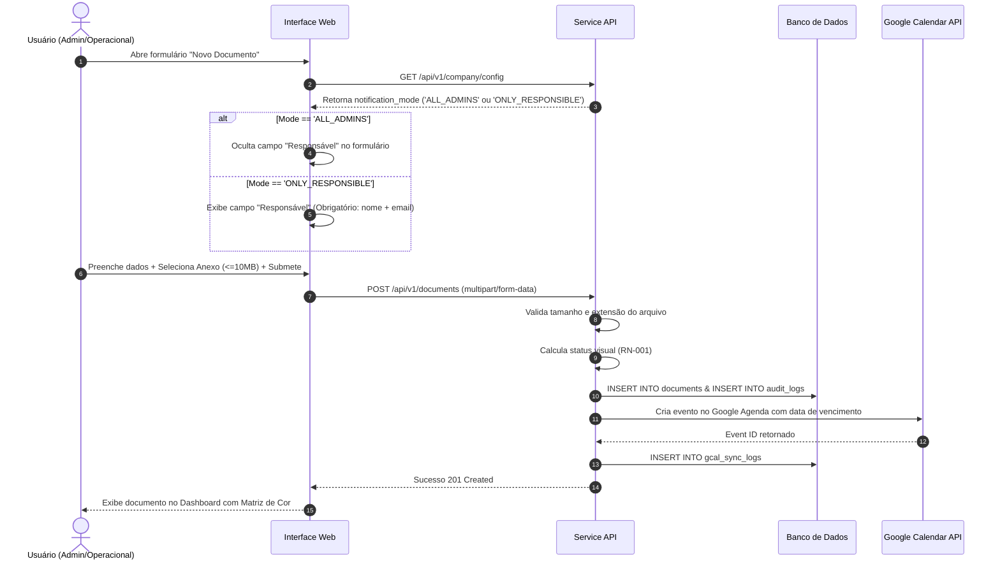
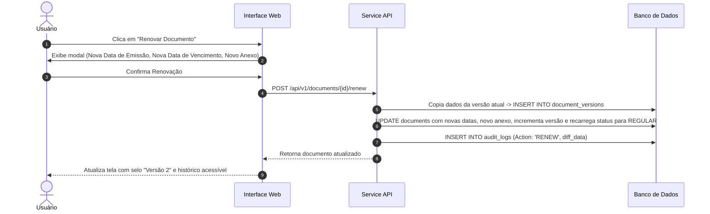

# Especificação de Arquitetura do Sistema - DocsOb

| Informação | Detalhe |
| :--- | :--- |
| **Projeto** | DocsOb - Gestão de Vencimento de Documentos |
| **Fase Atual** | Fase 2: Design e Arquitetura do Sistema |
| **Status** | Aprovado para Implementação |
| **Versão** | 1.0.0 |
| **Data** | 2026-08-07 |
| **Documento Relacionado** | [PRD.md](file:///C:/Users/contadoc_/orca/workspaces/DocsOb/Criar-o-prot%C3%B3tipo-da-UI/docs/PRD.md) |

---

## 1. Visão Geral da Arquitetura

O sistema **DocsOb** é construído sob uma arquitetura desacoplada e moderna (Client-Server / RESTful API), projetada para responder com alta performance (tempo de resposta < 2s), garantindo auditoria imutável, sincronização proativa de prazos e controle estrito de acessos baseado em perfis (RBAC).



---

## 2. Modelo de Dados (ERD - Entidade e Relacionamento)

### 2.1 Diagrama Entidade-Relacionamento (Mermaid ERD)



---

## 3. Dicionário de Dados e Estrutura de Tabelas

### 3.1 Tabela: `company_config` (Configurações Globais da Empresa)
- `id` (UUID, PK): Identificador único da empresa.
- `notification_mode` (VARCHAR(30), NOT NULL): Define o comportamento de notificações e de formulário:
  - `'ALL_ADMINS'`: Todos os Administradores recebem alertas. O campo "Responsável" fica **oculto** na UI e nulo no banco.
  - `'ONLY_RESPONSIBLE'`: Apenas o e-mail do Responsável cadastrado no documento recebe os alertas. Campo "Responsável" é **obrigatório**.
- `updated_at` (TIMESTAMP, NOT NULL): Data e hora da última alteração de configuração.
- `updated_by_id` (UUID, FK -> `users.id`): ID do Administrador que alterou a regra.

---

### 3.2 Tabela: `users` (Usuários e Controle de Acesso)
- `id` (UUID, PK): Identificador do usuário.
- `name` (VARCHAR(150), NOT NULL): Nome completo do usuário.
- `email` (VARCHAR(150), UNIQUE, NOT NULL): E-mail corporativo.
- `password_hash` (VARCHAR(255), NOT NULL): Hash bcrypt/argon2 da senha.
- `role` (VARCHAR(20), NOT NULL): Papel de acesso:
  - `'ADMIN'`: Acesso total, incluindo audit log, visualização de arquivados, gestão de usuários e configurações.
  - `'OPERATIONAL'`: Acesso a cadastro, edição, renovação e arquivamento (não visualiza arquivados, não gerencia usuários nem configurações).
- `is_active` (BOOLEAN, DEFAULT TRUE): Status da conta (Ativo / Inativo).
- `created_at` (TIMESTAMP, DEFAULT NOW()): Data de cadastro.

---

### 3.3 Tabela: `documents` (Cadastro Principal de Documentos)
- `id` (UUID, PK): Identificador do documento.
- `title` (VARCHAR(200), NOT NULL): Nome ou título do documento.
- `category_id` (UUID, FK -> `document_categories.id`, NOT NULL): Categoria/Tipo (ex: Fiscal, Trabalhista, Licença).
- `issuing_body` (VARCHAR(150), NULLABLE): Orgão ou entidade emissora.
- `issue_date` (DATE, NOT NULL): Data de emissão do documento.
- `expiration_date` (DATE, NULLABLE): Data de vencimento. (Null = Indeterminado).
- `alert_lead_days` (INT, DEFAULT 30): Antecedência em dias para disparar os alertas (ex: 60, 30, 15 ou 7).
- `status` (VARCHAR(30), NOT NULL): Status visual calculado:
  - `'EXPIRED'` (🔴 Vencido)
  - `'CRITICAL'` (🟡 Alerta Crítico)
  - `'RENEWAL_IN_PROGRESS'` (🔵 Em Renovação)
  - `'REGULAR'` (🟢 Regular / Em Dia)
  - `'INDETERMINATE'` (⚪ Validade Permanente)
- `responsible_name` (VARCHAR(150), NULLABLE): Nome do responsável (condicional).
- `responsible_email` (VARCHAR(150), NULLABLE): E-mail do responsável (condicional).
- `attachment_url` (VARCHAR(500), NULLABLE): URL/Path do anexo no storage.
- `attachment_filename` (VARCHAR(255), NULLABLE): Nome original do arquivo.
- `file_size_bytes` (INT, CHECK <= 10485760): Tamanho do arquivo em bytes (máximo 10 MB).
- `file_mime_type` (VARCHAR(100)): Tipo do arquivo (`application/pdf`, `image/png`, `image/jpeg`).
- `notes` (TEXT, NULLABLE): Observações e instruções de renovação.
- `is_archived` (BOOLEAN, DEFAULT FALSE): Soft delete (Documento arquivado).
- `created_by_id` (UUID, FK -> `users.id`): Usuário que criou o registro.
- `created_at` (TIMESTAMP, DEFAULT NOW()): Data de criação.
- `updated_at` (TIMESTAMP, DEFAULT NOW()): Data da última atualização.

---

### 3.4 Tabela: `document_versions` (Histórico de Renovações)
- `id` (UUID, PK): Identificador da versão anterior.
- `document_id` (UUID, FK -> `documents.id`, NOT NULL): Referência ao documento original.
- `version_number` (INT, NOT NULL): Número da versão (1, 2, 3...).
- `issue_date` (DATE, NOT NULL): Data de emissão da versão antiga.
- `expiration_date` (DATE, NOT NULL): Data de vencimento da versão antiga.
- `attachment_url` (VARCHAR(500)): Link do anexo histórico.
- `notes` (TEXT): Observações da renovação.
- `renewed_by_id` (UUID, FK -> `users.id`): Usuário que efetuou a renovação.
- `created_at` (TIMESTAMP, DEFAULT NOW()): Data do registro da renovação.

---

### 3.5 Tabela: `audit_logs` (Trilha de Auditoria - RN-008)
- `id` (UUID, PK): Identificador do registro de auditoria.
- `document_id` (UUID, FK -> `documents.id`, NOT NULL): Documento auditado.
- `user_id` (UUID, FK -> `users.id`, NOT NULL): Autor da ação.
- `user_name` (VARCHAR(150), NOT NULL): Nome do usuário no momento da ação.
- `action` (VARCHAR(30), NOT NULL): `'CREATE'`, `'UPDATE'`, `'ARCHIVE'`, `'UNARCHIVE'`, `'DELETE'`, `'RENEW'`.
- `diff_data` (JSONB, NOT NULL): Objeto JSON com as diferenças detalhadas:
  ```json
  {
    "expiration_date": { "old": "2026-08-01", "new": "2027-08-01" },
    "status": { "old": "EXPIRED", "new": "REGULAR" }
  }
  ```
- `timestamp` (TIMESTAMP, DEFAULT NOW()): Data e hora exata da ação.

---

## 4. Matriz de Cores e Lógica de Cálculo de Status (RN-001)

O cálculo do status visual deve ser reavaliado dinamicamente no frontend e processado via rotina batch diária (cron job à meia-noite):

```
SE expiration_date É NULL OU tipo É "Sem Vencimento":
    Status = ⚪ INDETERMINATE (Indeterminado)
SENÃO SE status_manual É "Em Renovação":
    Status = 🔵 RENEWAL_IN_PROGRESS (Em Renovação)
SENÃO SE DataAtual > expiration_date:
    Status = 🔴 EXPIRED (Vencido)
SENÃO SE (expiration_date - DataAtual) <= alert_lead_days:
    Status = 🟡 CRITICAL (Alerta Crítico)
SENÃO:
    Status = 🟢 REGULAR (Em Dia)
```

---

## 5. Matriz de Controle de Acesso Baseado em Papéis (RBAC - RF-014)

| Funcionalidade / Recurso | Administrador (`ADMIN`) | Operacional (`OPERATIONAL`) |
| :--- | :---: | :---: |
| Cadastrar e Editar Documentos | ✅ Sim | ✅ Sim |
| Anexar Arquivos (até 10 MB) | ✅ Sim | ✅ Sim |
| Sinalizar "Em Renovação" / Renovar Documento | ✅ Sim | ✅ Sim |
| Arquivar Documento (Soft Delete) | ✅ Sim | ✅ Sim |
| Visualizar Documentos Arquivados | ✅ Sim | ❌ Não (Filtro oculto) |
| Excluir Permanentemente (Hard Delete) | ✅ Sim | ❌ Não |
| Visualizar Trilha de Auditoria (Audit Log) | ✅ Sim | ❌ Não |
| Alterar Configurações da Empresa (RN-004) | ✅ Sim | ❌ Não |
| Gerenciar Usuários (Criar, Editar Roles, Inativar) | ✅ Sim | ❌ Não |

---

## 6. Fluxos de Trabalho Principais

### 6.1 Fluxo de Cadastro e Validação Condicional (RN-004)



---

### 6.2 Fluxo de Renovação com Histórico e Audit Log (RN-002 & RN-008)



---

## 7. Decisões de Arquitetura Tecnológica (ADRs)

1. **Stack de Desenvolvimento Local e Produção (Local-First com Portabilidade)**:
   - **Frontend**: Single-Page Application (SPA) responsiva em HTML5, CSS3 Vanilla (Design System com Dark Mode, Glassmorphism, Micro-animações CSS) e JS ES6 Modules.
   - **Backend**: API RESTful Node.js (TypeScript) com Express ou NestJS.
   - **Banco de Dados**: **PostgreSQL Local** (via Docker Compose ou serviço local) gerenciado com **Prisma ORM**. Custo zero no desenvolvimento inicial, garantindo 100% de paridade para migração futura à nuvem (Supabase, Neon, AWS RDS) apenas alterando a variável `DATABASE_URL`.
   - **Storage de Anexos**: Armazenamento em disco local (`./uploads/` estático/controlado) com limite de 10 MB no desenvolvimento/fase local, estruturado sob uma interface de storage (`IStorageService`) para permitir chaveamento imediato para Amazon S3 / Supabase Storage quando for para a nuvem.
   - **Notificação**: Serviço de e-mail transacional (Nodemailer / Resend / SendGrid) agendado via Cron Job diário.
   - **Calendário**: Google Calendar API via OAuth2 Service Account.

2. **Estratégia de Custo Zero e Testabilidade**:
   - Manter o ambiente 100% autossuficiente e executável localmente (banco de dados, uploads e backend), eliminando custos de infraestrutura em nuvem na fase inicial.
   - Desenvolver o backend desacoplado com migrations automatizadas do Prisma para que a transição para nuvem seja uma operação de deploy sem alterações no código de negócio.

---

## 8. Próximos Passos (Fase 3 - Implementação do Backend e Banco de Dados)

Com a arquitetura, modelo ERD, especificações e estratégia local-first aprovadas:
1. Criar a configuração local de ambiente (`docker-compose.yml` e schema do Prisma para PostgreSQL).
2. Inicializar o backend em Node.js/TypeScript e estruturar o upload local de arquivos.
3. Conectar a interface UI às rotas da API RESTful.
